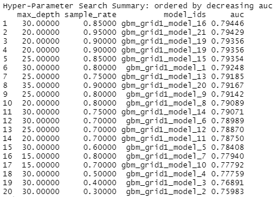

```{r message=FALSE, warning=FALSE}
library(tidyverse)
library(knitr)
library(h2o)
h2o.init()
```

## Duomenų apjungimas

```{r}
library(readr)
library(tidyverse)

#Darbinio failo apjungimas, modeliavimnui naudojome šį

data <- read_csv("../../project/1-data/1-sample_data.csv")

select(data, y)

data_additional <- read_csv("../../project/1-data/3-additional_features.csv")

joined_data1 <- inner_join(data, data_additional, by = "id")

write_csv(joined_data1, "../../project/1-data/train_data.csv") 

#Didžiojo failo apjungimas. Šio failo nepanaudojome dėl komputavimo resursų trūkumo

# data_additional2 <- read_csv("../../project/1-data/2-additional_data.csv")
# data_additional3 <- read_csv("../../project/1-data/3-additional_features.csv")
# 
# joined_data <- union(data, data_additional2)
# 
# 
# data_full <- joined_data %>%
#    inner_join(data_additional3, by = "id")
# 
# 
# write_csv(data_full, "../../project/1-data/train_data2.csv") 

```

## Duomenų importavimas

```{r message=FALSE, warning=FALSE, cache=TRUE}
df <- h2o.importFile("../../project/1-data/train_data.csv")
y <- "y"
x <- setdiff(names(df), c(y, "id"))
df$y <- as.factor(df$y)
```

## Duomenų failo dimensijos:

```{r}
dim(df)
```

## Kintamųjų apžvalga

```{r}
df$term <- as.factor(df$term)
df$credit_score <- as.factor(df$credit_score)
df$loan_purpose <- as.factor(df$loan_purpose)
summary(df[1:6])
```

```{r}
df$home_ownership <- as.factor(df$home_ownership)
summary(df[7:13]) %>%
  kable()
```

```{r echo=FALSE, message=FALSE, warning=FALSE}
summary(df[14:17]) %>%
  kable()
```

## Klasių tipo kintamųjų apžvalga


```{r}
h2o.nacnt(df)

summary(df$y, exact_quantiles=TRUE)

summary(df$term, exact_quantiles=TRUE)

summary(df$credit_score, exact_quantiles=TRUE)

summary(df$loan_purpose, exact_quantiles=TRUE)

summary(df$home_ownership, exact_quantiles=TRUE)

```
Y kintamojo pasiskirstymas - 50%. N/A reikšmių daugiausia kintamajame "months_since_last_delinquent". Ištrynus šį stulpelį spėjimo kokybė suprastėjo, ištrynus eilutes su N/A reikšmėmis prarandama didelė dalis (daugiau nei 60%) duomenų. Keisti šias reikšmes stulpelio reikšmių vidurkiu neatrodo gera mintis, kadangi kiekvienas atvejis individualus. Tad modelį kūrėme su duomenimis, kuriuose yra N/A reikšmių. 

```{r}
df1=as.data.frame(df)

df1 %>%
  group_by(loan_purpose) %>%
  summarise(n = n())  %>%
  arrange(desc(n)) %>%
  kable()
```


```{r message=FALSE, warning=FALSE}
df1 %>%
  group_by(y, loan_purpose) %>%
  summarise(n = n()) %>%
  ggplot(aes(fill=y, y=n, x=loan_purpose)) + 
  geom_bar(position="dodge", stat="identity") + 
  coord_flip() +
  scale_y_continuous(labels = scales::comma) +
  theme_dark()
```

Daugiausiai bankrotų imant paskolą šiems tikslams:

```{r message=FALSE, warning=FALSE}
df1 %>%
  filter(y == 1) %>%
  group_by(loan_purpose) %>%
  summarise(n = n()) %>%
  arrange(desc(n)) %>%
  head(10) %>%
  kable()
```

Trūksta apie 30% duomenų. Daugiau nei 70% žmonių turi gerą arba labai gerą kredito įvertinimą, tačiau didesnė dalis jų paskolos negauna. 

```{r message=FALSE, warning=FALSE}
library(plotly)
df1 %>%
  group_by(y, credit_score) %>%
  summarise(n = n()) %>%
  plot_ly(x = ~credit_score, y = ~n, name = ~y, type = "bar")
```

Dažniau prašoma trumpalaikių paskolų, tačiau didesnioji dalis prašančiųjų tokio tipo paskolos jos negauna. Ir atvirkščiai - didesnioji dalis prašymų gauti ilgalaikę paskolą būna .

```{r}
df1 %>%
  group_by(term) %>%
  summarise(n = n())  %>%
  arrange(desc(n)) %>%
  kable()

df1 %>%
  group_by(y, term) %>%
  summarise(n = n()) %>%
  plot_ly(x = ~term, y = ~n, name = ~y, type = "bar")
```

Daugiau nei 90% prašančiųjų paskolos neturi nuosavo būsto ir jį nuomojasi arba moka už jį paskolą.

```{r}
df1 %>%
  group_by(home_ownership) %>%
  summarise(n = n())  %>%
  arrange(desc(n)) %>%
  kable()

df1 %>%
  group_by(y, home_ownership) %>%
  summarise(n = n()) %>%
  plot_ly(x = ~home_ownership, y = ~n, name = ~y, type = "bar")
```


## Modelio kūrimas

Duomenų skaidymas į mokymo, validacijos ir testavimo imtis

```{r}
splits <- h2o.splitFrame(df, c(0.6,0.2), seed=123)
train  <- h2o.assign(splits[[1]], "train") # 60%
valid  <- h2o.assign(splits[[2]], "valid") # 20%
test   <- h2o.assign(splits[[3]], "test")  # 20%
```
Modeliavimui pasirinkome GBM algoritmą. Taip pat išbandėme RandomForest, tačiau GBM davė geresnį rezultatą.

```{r}
gbm_params1 <- list(max_depth = c(30),
                    sample_rate = c(0.8))

gbm_grid1 <- h2o.grid("gbm",
                      x = x,
                      y = y,
                      grid_id = "gbm_grid1",
                      training_frame = train,
                      validation_frame = valid,
                      ntrees = 50,
                      seed = 1234,
                      hyper_params = gbm_params1)

gbm_gridperf1 <- h2o.getGrid(grid_id = "gbm_grid1",
                             sort_by = "auc",
                             decreasing = TRUE)
print(gbm_gridperf1)
```

Atlikus "grid search" su skirtingais "max_depth" ir "sample_rate" parametrais, gauti tokie rezultatai:

 
Paveiksle matomos ne visos parametro "max_depth" reikšmės, kurios buvo išbandytos, tačiau 25-30 intervale gauti rezultatai buvo geriausi, tad toliau modelis gerinamas daugiausiai naudojantis šiomis reikšmėmis.

AUC rodiklis ant darbinio duomenų rinkinio nebuvo gautas aukštesnis nei 0,8, tačiau dėl komputavimo pajėgumų trūkumo negalime modelio pritaikyti ant didžiojo "train_data2" failo. Tai, jog vis tik pasiekėme 0,8 AUC rodiklį parodė Jūsų paties atliktas patikrinimas 1 spėjimo metu.

```{r}
gbm_gridperf1 <- h2o.getGrid(grid_id = "gbm_grid1",

sort_by = "auc",

decreasing = TRUE)

print(gbm_gridperf1)

model_gbm <- h2o.getModel("gbm_grid1_model_1")

model_gbm
```

Patikriname, kurie parametrai turi didžiausią svarbą apmokant modelį:

```{r}
var_imp <- h2o.varimp_plot(model_gbm)
```

Paveiksle matyti, jog didžiausią įtaką modelio apmokymui daro parametrai "yearly_income", "monthly_debt" ir "credit_score".

Išbandome modelį ant validavimo duomenų:

```{r}
h2o.performance(model_gbm, newdata = valid)
```

Ir ant testavimo duomenų

```{r}
h2o.performance(model_gbm, newdata = test)
```

Išsaugome modelį

```{r}
h2o.saveModel(model_gbm, "../../project/4-model", filename = "gbm_model")

predictions_rf <- h2o.predict(model_gbm, test_data) %>%

as_tibble()

predictions_rf
```
